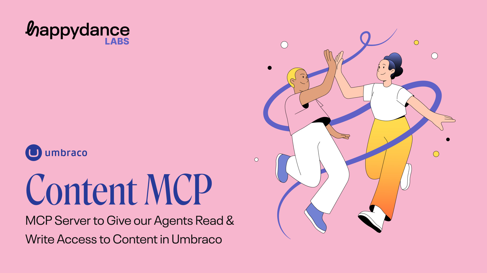

# Umbraco MCP Server



A Model Context Protocol (MCP) server implementation for Umbraco CMS, allowing LLMs to access and manipulate Umbraco content through standardized interfaces.

## Overview

This repository provides a Model Context Protocol server that connects to Umbraco CMS, enabling AI models like Claude to:

- Retrieve content from Umbraco
- Execute operations against the Umbraco Management API
- Access document types, media, and other Umbraco resources
- Perform actions through standardized tool interfaces

## Installation

```bash
# Clone the repository
git clone https://github.com/HappydanceLabs/umbraco-mcp-server.git

# Navigate to the project directory
cd umbraco-mcp-server

# Install dependencies
npm install

# Generate Umbraco API types
npm run generate:umbraco

# Start the development server
npm run dev
```

The server will be available at [http://localhost:8787/](http://localhost:8787/)

## Connect the MCP Inspector

To explore the MCP API and test available resources and tools:

1. Start the MCP Inspector:
   ```bash
   npm run mcp:inspector
   ```
   
2. In the Inspector interface, switch the Transport Type to `SSE` and enter `http://localhost:8787/mcp` as the URL.

3. Click "Connect" and follow any authentication prompts.

4. Once connected, you can list and call the available resources and tools.

## Connect to Claude Desktop

To use this MCP server with Claude:

1. Install Claude Desktop and follow [Anthropic's MCP Quickstart](https://modelcontextprotocol.io/quickstart/user)

2. In Claude Desktop, go to Settings > Developer > Edit Config

3. Replace the configuration with:

```json
{
  "mcpServers": {
    "umbraco": {
      "command": "npx",
      "args": [
        "mcp-remote",
        "http://localhost:8787/mcp"
      ]
    }
  }
}
```

4. Restart Claude and you'll be able to use the Umbraco tools directly from Claude.

## Deployment

1. Create a KV namespace for OAuth:
   ```bash
   npx wrangler kv namespace create OAUTH_KV
   ```

2. Add the KV namespace ID to `wrangler.jsonc`

3. Deploy to Cloudflare Workers:
   ```bash
   npm run deploy
   ```

4. Update your Claude configuration to use your deployed URL:
   ```json
   {
     "mcpServers": {
       "umbraco": {
         "command": "npx",
         "args": [
           "mcp-remote",
           "https://your-worker-url.workers.dev/sse"
         ]
       }
     }
   }
   ```

## Project Structure

- `/src/api`: Umbraco API clients and interfaces
- `/src/resources`: MCP resource implementations for reading Umbraco data
- `/src/tools`: MCP tool implementations for executing operations
- `/src/helpers`: Utility functions and shared code
- `/src/types`: TypeScript type definitions

## Development

This project uses the [Model Context Protocol TypeScript SDK](https://github.com/modelcontextprotocol/typescript-sdk) and [Cloudflare Agents SDK](https://agents.cloudflare.com/) to implement resources and tools according to the MCP specification. Hosted and deployed on a Cloudflare Worker.

For more information on the MCP protocol, see the [official documentation](https://modelcontextprotocol.io/).

## Debugging

If you encounter issues:

```bash
# Test direct connection to the MCP server
npx mcp-remote http://localhost:8787/sse

# Clear MCP authentication cache if needed
rm -rf ~/.mcp-auth
```
